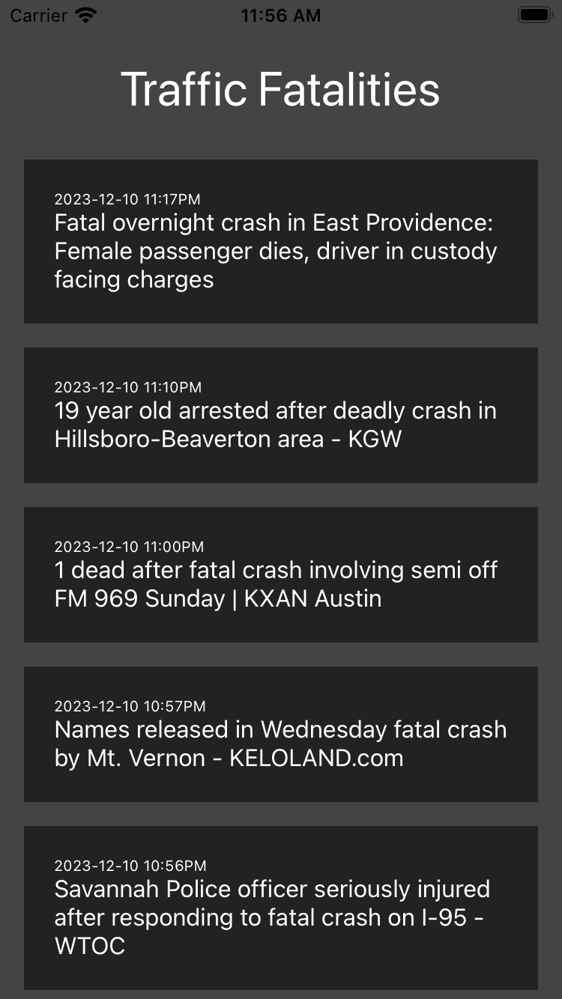

# Traffic Fatalities

This is a [**React Native**](https://reactnative.dev) project, bootstrapped using [`@react-native-community/cli`](https://github.com/react-native-community/cli).

Its intent is to remind people, throughout the day, how frequently lives are lost to traffic tragedies, and hopefully to come to see such fatalities as intolerable instead of inevitable.

It is my first foray into React Native.

## Screenshot



## TODO

- [x] Initial development
- [ ] Implement push notifications
- [ ] Improve design
- [ ] Refactor
- [ ] Deploy to and test on real devices
  - [ ] iOS
  - [ ] Android
- [ ] Release

## Running the project locally

Complete the [React Native - Environment Setup](https://reactnative.dev/docs/environment-setup) instructions up until "Creating a new application" step before proceeding.

### Step 1: Start the Metro Server

First, you will need to start **Metro**, the JavaScript _bundler_ that ships _with_ React Native.

To start Metro, run the following command from the _root_ of the React Native project:

```bash
# using npm
npm start

# OR using Yarn
yarn start
```

### Step 2: Start the Application

Let Metro Bundler run in its _own_ terminal. Open a _new_ terminal from the _root_ of the React Native project. Run the following command to start the _Android_ or _iOS_ app:

#### For Android

```bash
# using npm
npm run android

# OR using Yarn
yarn android
```

#### For iOS

```bash
# using npm
npm run ios

# OR using Yarn
yarn ios
```

If everything is set up _correctly_, you should see the app running in your _Android Emulator_ or _iOS Simulator_ shortly provided you have set up your emulator/simulator correctly.

This is one way to run the app — you can also run it directly from within Android Studio and Xcode respectively.